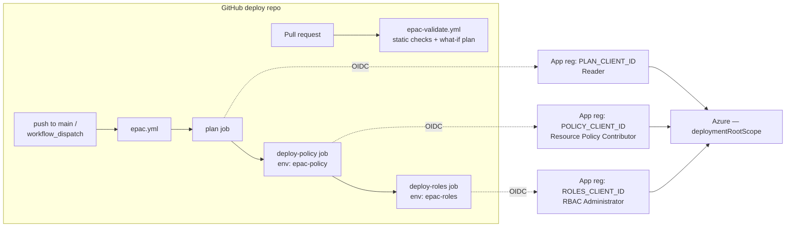

# Setting up the GitHub deploy repo

This package **is** the root of a dedicated deploy repository. This guide takes you from an
empty GitHub repo to a working `plan → deploy-policy → deploy-roles` pipeline. It covers the
GitHub-platform pieces the top-level `README.md` only names in passing: **runners**,
**environments**, **authentication (OIDC)**, **branch protection**, and the **GitHub plan/licensing**
you need for each.

It is written for the **EPAC (json)** flavour of the package — the one whose pipeline is
`.github/workflows/epac.yml`. If you generated a Terraform or Bicep package the identities and
secrets differ; the platform steps (repo, runners, environments, licensing) still apply.

> **This guide travels with the package.** It does not assume you have the builder repo — only
> the rendered package you are holding.

---

## 0. The shape of it

Three least-privilege identities, one per job. No stored client secrets — each job gets a
short-lived token from GitHub via **workload identity federation (OIDC)**.

---

## 1. Create the repository

1. Create a **new, empty** repository (private is normal for a policy deploy repo).
2. Commit the **contents of this package at the top level** — `Definitions/`, `.github/`,
   `validate-package.py`, `docs/`, `README.md` must sit at the repo root. GitHub only discovers
   workflows under `.github/workflows/` at the **root**, and the pipeline resolves `Definitions/`
   from the root. Do **not** drop the package in as a subfolder of an existing repo.
3. Keep `main` as the default branch — the pipeline triggers on `push` to `main`.

---

## 2. GitHub plan / licensing — what you actually need

Most of this pipeline works on **any** GitHub plan, including Free. Two things depend on your plan
**when the repo is private**:

| Feature | Public repo | Private / internal repo |
| --- | --- | --- |
| **Environments + protection rules** (required reviewers, wait timer, branch restrictions) — this is how you gate `epac-policy` / `epac-roles` | All plans | **GitHub Pro, Team, or Enterprise** (not Free) |
| **OIDC / workload identity federation** | All plans | All plans |
| **Self-hosted runners** | All plans | All plans |
| **Branch protection / rulesets** (require the PR check before merge) | All plans | All plans (some org-level ruleset controls need Team/Enterprise) |
| **GitHub-hosted runner minutes** | Free (standard runners) | Included monthly minutes, then billed |

The one that bites: **required reviewers on an environment need a paid plan on a private repo.**
If you are on Free and the repo is private, either move to Team/Enterprise, make an approval gate
another way (e.g. a protected `main` + PR review before merge), or accept ungated deploys in a
non-production environment.

> GitHub changes plan boundaries over time — confirm the current matrix at
> <https://docs.github.com/actions> before you buy seats.

---

## 3. Runners

The pipeline runs on **`ubuntu-latest` GitHub-hosted runners** and needs nothing special: each job
installs PowerShell modules (`Install-Module EnterprisePolicyAsCode`) and calls `azure/login`.

**Use GitHub-hosted runners unless** one of these forces self-hosted:

- Your Azure management endpoints are reachable only from inside a **private network / VNet**.
- Org policy forbids GitHub-hosted runners, or requires a hardened image.
- You need a warm module cache or pinned tool versions for speed/compliance.

If you go self-hosted, the runner must have **outbound** access to the PowerShell Gallery
(`Install-Module`) and the Azure management endpoints, plus **PowerShell 7.4+**. Register runners at
the repo or org level and, on private repos, watch that hosted-runner **minutes** are billed while
self-hosted minutes are not.

---

## 4. Authentication — OIDC (no secrets to store)

Create **three** Microsoft Entra app registrations and give each the least-privilege Azure role for
its job, assigned at (or above) your `deploymentRootScope`:

| App registration | Azure role | Used by |
| --- | --- | --- |
| plan | **Reader** | `plan` job (`Build-DeploymentPlans`) |
| policy | **Resource Policy Contributor** | `deploy-policy` job (`Deploy-PolicyPlan`) |
| roles | **Role Based Access Control Administrator** | `deploy-roles` job (`Deploy-RolesPlan`) |

For **each** app registration, add a **Federated credential** (Certificates & secrets → Federated
credentials → *Other issuer*, or the GitHub Actions preset):

- **Issuer:** `https://token.actions.githubusercontent.com`
- **Audience:** `api://AzureADTokenExchange`
- **Subject:** must match the exact GitHub context the job runs in:
  - deploy jobs run inside an environment → `repo:<org>/<repo>:environment:epac-policy` (policy app)
    and `repo:<org>/<repo>:environment:epac-roles` (roles app)
  - the `plan` job has no environment → subject on the branch:
    `repo:<org>/<repo>:ref:refs/heads/main`
  - the PR what-if plan (`epac-validate.yml`) runs on pull requests →
    `repo:<org>/<repo>:pull_request` (same plan/Reader app)

A federated credential matches **one** subject, so add multiple credentials to the plan app (one for
`ref:refs/heads/main`, one for `pull_request`).

Then set the repository (or environment) **secrets**:

| Secret | Value |
| --- | --- |
| `AZURE_TENANT_ID` | your Entra tenant id |
| `AZURE_SUBSCRIPTION_ID` | a subscription in the tenant (for the login context) |
| `PLAN_CLIENT_ID` | plan app registration — Application (client) ID |
| `POLICY_CLIENT_ID` | policy app registration — client ID |
| `ROLES_CLIENT_ID` | roles app registration — client ID |

The workflows already declare `permissions: id-token: write` — that, plus the federated credentials
above, is what lets `azure/login` work **without any client secret**. Never add
`AZURE_CLIENT_SECRET`; if an editor flags `secrets.*` as "Context access might be invalid" before you
create them, that is an editor hint, not an error — it clears once the secrets exist.

---

## 5. Environments

Create two environments (Settings → Environments): **`epac-policy`** and **`epac-roles`** — the exact
names the `deploy-policy` and `deploy-roles` jobs reference.

On each environment:

- Add **Required reviewers** so a human approves before the deploy job runs. This is your production
  gate. *(Requires a paid plan on private repos — see §2.)*
- Optionally restrict the environment to the **`main`** branch (Deployment branches).
- Environment **secrets** override repo secrets if you want per-environment client IDs.

The `plan` job intentionally has **no** environment — it only reads (Reader) and should run freely so
reviewers see the plan before approving the deploy.

---

## 6. Branch protection & the PR gate

The package ships `.github/workflows/epac-validate.yml`, which runs on every pull request:

- **`validate`** — offline static checks (`validate-package.py`): parses every file, confirms each
  assignment has a `scope` for **every** pacSelector (a missing one is silently skipped by EPAC),
  and checks references and id shapes. Runs on **all** PRs, forks included (no secrets needed).
- **`plan`** — a real `Build-DeploymentPlans` what-if with the Reader identity. Guarded to
  **same-repo** PRs, so PRs from forks skip it (a fork gets no secrets) rather than fail.

Protect `main` (Settings → Branches, or a ruleset) and **require the `validate` status check** before
merge, plus at least one review. That makes the static gate mandatory and keeps unreviewed policy
changes off `main`.

---

## 7. First deploy

1. Merge the package to `main` through a PR (so the validate gate runs).
2. Run the **EPAC deploy** workflow manually (Actions → *EPAC deploy* → *Run workflow*), targeting
   your **dev** pacEnvironment first (the `pacEnvironment` input).
3. Watch `plan` → approve `deploy-policy` → approve `deploy-roles`.
4. Only after dev looks right, run it against your tenant pacEnvironment.

EPAC reconciles a whole `deploymentRootScope` and **deletes** policy objects in that scope that are
not in code — the pipeline's `concurrency` guard already prevents two overlapping runs, but always
review the plan before approving a deploy.

---

## 8. Checklist

- [ ] Repo created; package committed **at the root**; default branch `main`
- [ ] Plan sufficient for environment protection on a private repo (§2)
- [ ] Three app registrations with Reader / Resource Policy Contributor / RBAC Administrator
- [ ] Federated credentials added for each subject (main ref, pull_request, both environments)
- [ ] Secrets `AZURE_TENANT_ID`, `AZURE_SUBSCRIPTION_ID`, `PLAN_/POLICY_/ROLES_CLIENT_ID`
- [ ] Environments `epac-policy` and `epac-roles` with required reviewers
- [ ] `main` protected; `validate` check required before merge
- [ ] Dev deploy run and reviewed before touching the tenant scope

## References

- EPAC — GitHub Actions: <https://azure.github.io/enterprise-azure-policy-as-code/ci-cd-github-actions/>
- OIDC from GitHub Actions to Azure: <https://learn.microsoft.com/azure/developer/github/connect-from-azure-openid-connect>
- GitHub Environments & protection rules: <https://docs.github.com/actions/deployment/targeting-different-environments/using-environments-for-deployment>
